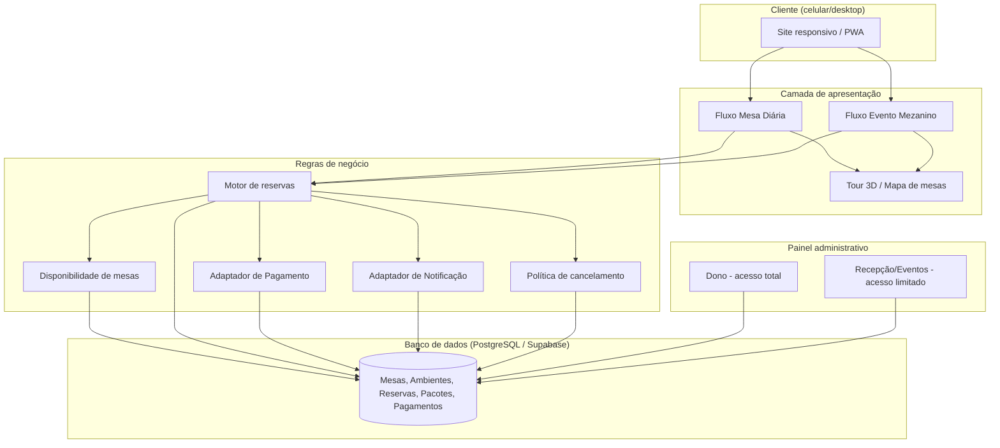
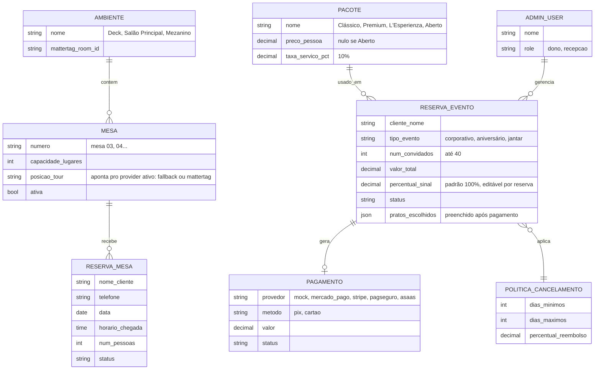
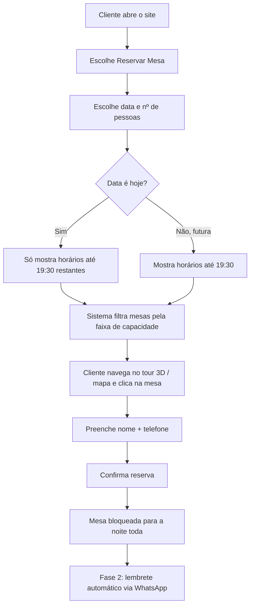
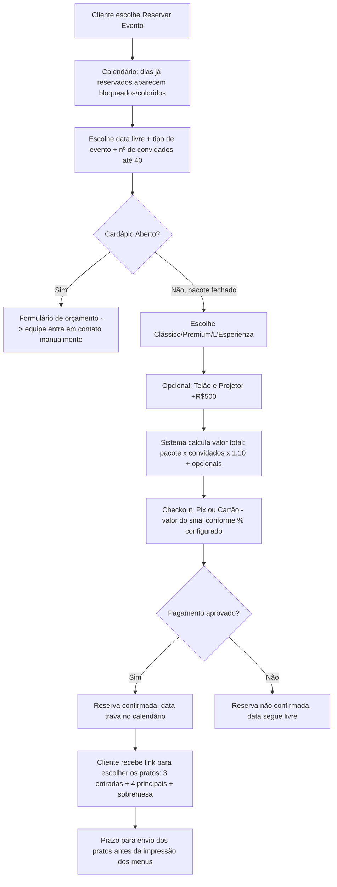

# Sistema de Reservas e Eventos — Antonina Osteria

## Contexto

A Antonina Osteria precisa de um sistema (site responsivo, mobile-first, com comportamento de PWA) para dois produtos distintos:

1. **Reserva de mesa diária** — reserva rápida e gratuita, aceita até as 19:30 (após esse horário, atendimento por ordem de chegada).
2. **Reserva de evento no mezanino** — pacotes fechados para até 40 pessoas (corporativo, aniversário, jantar reservado), com checkout automático e pagamento antecipado.

O restaurante tem um tour 3D no Matterport (`https://my.matterport.com/show/?m=noadeK6Syis`, produzido pela Realia Tour Virtual 3D) cobrindo três ambientes: **Deck** (externo), **Salão Principal** (mesas numeradas com banquetas, mesas de janela, bar) e **Mezanino** (Floor 2, espaço flexível/reconfigurável para eventos). O objetivo é que o cliente navegue visualmente pelo restaurante e escolha a mesa/ambiente dentro dessa experiência.

Não existe site institucional hoje — este projeto é o primeiro. Divulgação acontece via link na bio do Instagram. O sistema é para uso exclusivo da Antonina Osteria, mas desenhado com separação modular (mesas/ambientes como módulo isolado) pensando em uma eventual revenda futura para outros restaurantes — sem construir multi-tenancy agora (YAGNI).

Este documento é quem desenvolve o projeto (agência/dev) autoconduzindo, no papel do gestor do restaurante, o levantamento de requisitos antes de qualquer implementação.

## Pacotes de evento (fonte: `pacotes-eventos-antonina.pdf`)

| Pacote | Preço/pessoa (+10% serviço) | Bebidas inclusas |
|---|---|---|
| Clássico | R$ 197,00 | Não alcoólicas à vontade |
| Premium | R$ 250,00 | Não alcoólicas à vontade |
| L'Esperienza | R$ 297,00 | Não alcoólicas + Open Bar de vinhos tintos/brancos (3h) |
| Cardápio Aberto | Sem preço fixo — sempre orçamento manual | — |

Cada pacote fechado: cliente escolhe 3 entradas + 4 pratos principais + sobremesa. Equipamento opcional: Telão & Projetor, R$ 500,00 (valor único). Regras do PDF: confirmação com mínimo 7 dias de antecedência (orientativa, não bloqueante — ver política de cancelamento), taxa de serviço de 10% sobre todos os valores por pessoa, definição do cardápio necessária antes da impressão dos menus, duração padrão do serviço de bebidas/open bar de 3 horas.

## Decisões de escopo confirmadas

- **Dois fluxos distintos**, não um formulário único: mesa diária (reserva de lugar) e evento (venda de pacote fechado).
- **Mesa diária:** reservável até as 19:30 (horário de chegada), inclusive no mesmo dia; sem cobrança, sem exigência de cartão; sem duração fixa — a mesa é do grupo pelo resto da noite (um slot por mesa por noite); cliente escolhe **mesa específica** (não categoria) dentro do ambiente navegado; após 19:30, sem reserva online, atendimento por ordem de chegada.
- **Evento no mezanino:** checkout 100% automático (cliente paga sozinho e confirma), sinal padrão de 100% do valor, **configurável por reserva individual no admin** (para casos negociados por telefone). Calendário do evento mostra datas já reservadas como indisponíveis visualmente. Cardápio Aberto nunca tem checkout automático — sempre vira pedido de orçamento manual.
- **Separação de etapas no evento:** pagamento/confirmação da data acontece primeiro (rápido, sem fricção); a escolha detalhada dos pratos (3 entradas + 4 principais + sobremesa) acontece depois, via link enviado após a confirmação — evita perder a data por indecisão de cardápio.
- **Pagamento:** Pix + cartão de crédito, através de um adaptador plugável (`PaymentProvider`) que suporta Mercado Pago, Stripe, PagSeguro e Asaas, escolhido no admin. Fase 1 usa um `MockProvider` para testes/demonstração.
- **Cancelamento de evento:** tabela proporcional configurável no admin (100% acima de 15 dias / 75% de 8-14 / 50% de 4-7 / 25% de 2-3 / 0% abaixo de 48h ou no-show). Reservas de última hora caem direto no degrau mais baixo. Checkout inclui ciência explícita sobre o Art. 49 do CDC (direito de arrependimento em compras online) para eventos com menos de 7 dias de antecedência — **a tabela de percentuais e o texto legal devem passar por revisão de um advogado antes do lançamento**, este documento define a estrutura técnica, não o parecer jurídico final.
- **No-show em mesa diária:** sem penalidade nem exigência de garantia; fica registrado no histórico do cliente no admin para decisões futuras.
- **Seleção de mesa 3D:** abstraída atrás de uma interface `TableMapProvider`. Fase 1 usa um mapa clicável (imagem/SVG sobre capturas do dollhouse) porque o acesso admin ao Matterport (para criar Mattertags) só é liberado após aprovação de contrato com a Realia. Quando liberado, troca-se a implementação para Mattertags reais sem alterar o restante do sistema.
- **Notificações:** abstraídas atrás de `NotificationProvider`. Fase 1 sem envio automático real (registro no admin ou link direto de WhatsApp); Fase 2 liga a API oficial do WhatsApp Business para confirmações e lembretes automáticos.
- **Painel administrativo:** dois perfis — Dono (acesso total, inclusive política de cancelamento, provedor de pagamento ativo, cadastro de mesas/ambientes/pacotes, usuários) e Recepção/Eventos (confirma reservas, vê mapa do dia, ajusta sinal de reserva individual negociada por telefone).
- **Plataforma:** site responsivo mobile-first com comportamento de PWA — sem app nativo, já que é um restaurante único e a instalação de app tem baixa adesão para uso ocasional.
- **Lançamento em fases**, não tudo de uma vez (ver Fases abaixo).

## Arquitetura técnica

**Stack escolhida:** Next.js (React) + PostgreSQL via Supabase (inclui autenticação para os perfis admin e realtime para disponibilidade) + hospedagem Vercel/Supabase.

Motivo: framework único para frontend e backend reduz superfície de manutenção para um restaurante único; PWA e SEO nativos ajudam o tráfego vindo do Instagram; Supabase resolve autenticação e realtime sem construir do zero. Alternativa descartada por ora: separar frontend/API completamente (faria sentido se/quando o sistema virar produto multi-tenant — a lógica de negócio já fica isolada o suficiente para essa extração futura não exigir reescrita).

## Modelo de dados

## Fluxo — Mesa Diária

## Fluxo — Evento no Mezanino

## Alocação de mesa por capacidade

Achados da exploração do tour Matterport (dollhouse + planta + caminhada): pelo menos três portes fixos de mesa existem no restaurante — mesas de ~4 lugares (deck e janelas do salão), mesas de ~5-6 lugares com banquetas (salão principal, já numeradas fisicamente: 03, 04...), e uma mesa comunal de ~12 lugares (mezanino, dia a dia). Como as mesas são físicas e fixas (sem adicionar/remover cadeiras), o sistema precisa evitar que um grupo pequeno ocupe uma mesa grande por padrão:

- Ao informar o número de pessoas, o cliente só vê mesas dentro de uma **faixa de encaixe aceitável** (ex: grupo de 2 vê mesas de 2-4 lugares, não vê mesas de 6 ou 12).
- Se não houver mesa na faixa ideal disponível no horário, o sistema libera a próxima faixa acima como opção secundária, com aviso.
- A equipe sempre pode alocar manualmente fora da regra pelo painel admin (ex: noite vazia).

**Pendência de implementação (não é dúvida de design):** o inventário exato de mesas x capacidade precisa ser confirmado pela equipe do restaurante antes do cadastro final — a exploração do tour deu a direção certa, mas não uma contagem certificada cadeira por cadeira.

## Adaptadores plugáveis

**Pagamento (`PaymentProvider`):** interface única, implementações `MockProvider` (Fase 1), `MercadoPagoProvider`, `StripeProvider`, `PagSeguroProvider`, `AsaasProvider`. O admin escolhe o provedor ativo; o checkout do cliente não muda visualmente ao trocar.

**Seleção de mesa (`TableMapProvider`):** `FallbackMapProvider` (Fase 1, mapa clicável sobre capturas do dollhouse) e `MattertagProvider` (quando o acesso admin ao Matterport for liberado pela Realia). Mesma UI e regras de negócio nos dois casos.

**Notificação (`NotificationProvider`):** Fase 1 sem envio automático real (registro no admin / link direto de WhatsApp); Fase 2 `WhatsAppBusinessProvider` via API oficial.

## Painel administrativo — permissões

| Ação | Dono | Recepção/Eventos |
|---|---|---|
| Ver mapa de reservas do dia (mesas + eventos) | ✅ | ✅ |
| Confirmar/cancelar reserva de mesa | ✅ | ✅ |
| Ver reservas de evento e status de pagamento | ✅ | ✅ |
| Editar percentual de sinal de uma reserva específica | ✅ | ✅ (caso negociado por telefone) |
| Editar tabela de política de cancelamento (os %) | ✅ | ❌ |
| Trocar provedor de pagamento ativo | ✅ | ❌ |
| Cadastrar/editar mesas, ambientes, pacotes, preços | ✅ | ❌ |
| Criar/remover usuários da equipe | ✅ | ❌ |

## Política de cancelamento (evento)

| Cancelamento com... | Reembolso padrão |
|---|---|
| 15+ dias | 100% |
| 8 a 14 dias | 75% |
| 4 a 7 dias | 50% |
| 2 a 3 dias | 25% |
| Menos de 48h / no-show | 0% |

Configurável no admin (tabela `POLITICA_CANCELAMENTO`), sem necessidade de deploy para ajustar. Reservas feitas em cima da hora caem direto no degrau mais baixo aplicável. Checkout deve incluir ciência explícita sobre o Art. 49 do CDC para eventos com menos de 7 dias entre pagamento e data do evento — **texto e tabela final sujeitos a revisão jurídica antes do lançamento**.

## Casos-limite e tratamento de erros

- **Concorrência na mesa diária:** trava a nível de banco — segunda tentativa na mesma mesa/noite recebe aviso e volta à seleção.
- **Concorrência no evento:** hold temporário (15 min) na data ao entrar no checkout; expira e libera se o pagamento não completar.
- **Confirmação de pagamento:** reserva de evento só vira "confirmada" após webhook do gateway, nunca no clique do botão.
- **Falha no pagamento:** reserva não confirmada, mensagem clara, data segue livre.
- **Exceção fora da tabela (força maior etc.):** override manual do dono no admin, com motivo registrado.
- **No-show mesa diária:** sem multa, mas registrado no histórico do cliente.
- **Cardápio Aberto:** nunca mostra checkout automático — sempre roteado para orçamento manual.
- **Prazo de escolha dos pratos do evento estourado:** não cancela automaticamente; gera alerta para contato manual da equipe.
- **Mesa em manutenção:** admin marca como inativa, some das opções sem apagar o cadastro.

## Plano de testes

- Unitários: cálculo do percentual de reembolso pela tabela, filtro de faixa de encaixe por capacidade, cálculo do valor total do evento.
- Contrato dos adaptadores: `PaymentProvider` e `NotificationProvider` testados via `MockProvider`.
- Integração: condição de corrida em reserva simultânea da mesma mesa/data.
- E2E (Playwright): fluxo completo de reserva de mesa diária; fluxo completo de reserva de evento com checkout mock.
- Visual/responsivo: breakpoints 320/768/1024/1440.
- Acessibilidade: navegação por teclado no seletor de mesas, com lista alternativa em texto das mesas disponíveis (o mapa/3D sozinho não é acessível).

## Fases de lançamento

**Fase 1 (núcleo mínimo funcional):**
- Tour 3D com seleção de mesa (fallback de mapa clicável)
- Reserva de mesa diária completa (até 19:30, sem pagamento)
- Reserva de evento completa com checkout e pagamento **mock** (Pix/cartão fake)
- Política de cancelamento proporcional (configurável)
- Painel admin básico: perfis Dono e Recepção

**Fase 2:**
- WhatsApp Business API real (confirmações e lembretes automáticos)
- Gateway de pagamento real conectado (escolha no admin entre Mercado Pago/Stripe/PagSeguro/Asaas)
- Troca do `FallbackMapProvider` para `MattertagProvider` real, quando o acesso Matterport for liberado
- Refinamento de papéis/permissões conforme uso real

## Pendências para fechar antes ou durante a implementação

1. Revisão jurídica da tabela de cancelamento e do texto de ciência sobre o Art. 49 do CDC.
2. Inventário definitivo de mesas × capacidade × ambiente, confirmado pela equipe do restaurante.
3. Liberação do acesso admin ao Matterport (dependente da aprovação do contrato com a Realia) para migrar do fallback para Mattertags reais.
4. Escolha do gateway de pagamento real e criação da conta correspondente (Fase 2).
5. Contratação da API oficial do WhatsApp Business / provedor (Fase 2).
