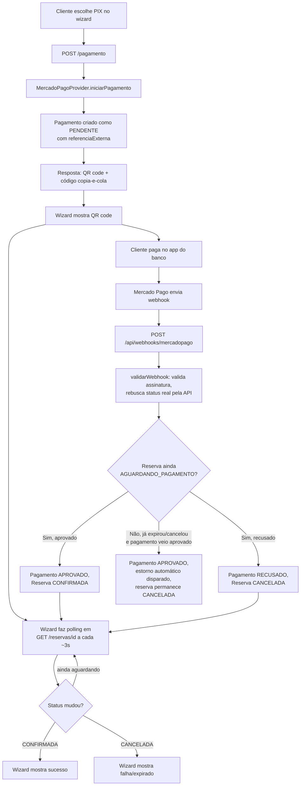

# Gateway de pagamento real (Mercado Pago, PIX) — Fase 2

## Contexto

O spec original (`docs/superpowers/specs/2026-08-03-sistema-reservas-eventos-design.md`) definiu a Fase 2 como três frentes independentes: WhatsApp Business real, gateway de pagamento real, e Mattertags reais. Este documento cobre só a primeira fatia da segunda frente: conectar o Mercado Pago de verdade (ainda em modo sandbox/teste) para pagamentos PIX de eventos, substituindo o `MockPaymentProvider` usado desde a Fase 1.

Decisões que definiram esse recorte:

- **Mattertags reais ficam de fora** — dependem da liberação do acesso ao Matterport pela Realia, que ainda não aconteceu (dependência externa, fora do nosso controle).
- **WhatsApp real fica pra depois** — o pagamento mock é o que hoje impede o negócio de cobrar de verdade; o WhatsApp é uma melhoria de UX sobre um fluxo que já funciona manualmente.
- **Mercado Pago foi o gateway escolhido** entre as opções já suportadas pela interface `PaymentProvider` (Mercado Pago/Stripe/PagSeguro/Asaas) — mais usado por pequenos negócios no Brasil, PIX nativo.
- **Sandbox real, não mock local** — usa o SDK oficial do Mercado Pago com credenciais de teste (gratuitas, sem aprovação de conta business), não uma simulação local que não valida a integração de verdade. Quando a conta de produção for aprovada, só troca as credenciais.
- **Só PIX nesta rodada** — cartão exigiria integrar o SDK de tokenização no cliente ou um checkout hospedado, dobrando o escopo. Fica pra uma próxima rodada, sem reabrir a arquitetura construída aqui.
- **Pagamento e estorno juntos** — a rota de cancelamento hoje só calcula e guarda o valor do reembolso; esta rodada liga o estorno de verdade no Mercado Pago também, fechando o ciclo completo (cobrar e devolver).
- **QR code na própria página**, não redirecionamento — mantém a experiência atual do wizard de reserva (o cliente nunca sai do site), e é como praticamente todo checkout PIX no Brasil funciona.

## Fora de escopo (explicitamente)

- Pagamento por cartão de crédito real.
- WhatsApp Business API real.
- Mattertags reais.
- Seletor de provedor de pagamento no painel admin (a troca continua sendo uma decisão de código/deploy, via variável de ambiente — like já estava documentado como pendência no plano do painel admin).
- Outros gateways (Stripe/PagSeguro/Asaas) — a interface `PaymentProvider` já é agnóstica de provedor, então adicionar outro no futuro não deve exigir mudanças fora de um novo arquivo `XProvider.ts` + a fábrica.

## Arquitetura

### Troca de provider por variável de ambiente, não por padrão

`getPaymentProvider()` (`src/providers/payment/getPaymentProvider.ts`) passa a checar `process.env.PAYMENT_PROVIDER`:

```ts
export function getPaymentProvider(): PaymentProvider {
  if (process.env.PAYMENT_PROVIDER === "mercadopago") {
    return new MercadoPagoProvider();
  }
  return new MockPaymentProvider();
}
```

Isso importa porque 7 dos 8 testes existentes de `pagamento/route.test.ts` dependem do retorno *padrão* da fábrica ser o mock síncrono (só 1 teste já faz `vi.spyOn` explícito). Trocar o padrão quebraria os outros 7 sem necessidade. Com a troca por variável de ambiente — só setada em `.env`/`docker-compose.yml` para dev/produção reais, nunca no ambiente de teste — nenhum teste existente precisa mudar, e o comportamento padrão (sem a variável) continua sendo o mock, o que é o lado seguro por padrão.

### `MercadoPagoProvider`

Novo arquivo `src/providers/payment/MercadoPagoProvider.ts`, implementando `PaymentProvider` com o SDK oficial `mercadopago` (pacote npm, a instalar), configurado com `MERCADOPAGO_ACCESS_TOKEN` (token de teste, formato `TEST-...`).

| Método | Comportamento |
|---|---|
| `iniciarPagamento` | Cria um pagamento PIX via API de Payments do Mercado Pago (`payment_method_id: "pix"`). Sempre retorna `status: "pendente"` — PIX nunca confirma na hora. `date_of_expiration` da cobrança é setado para coincidir com o `holdExpiresAt` da reserva (ver "Casos-limite"). |
| `validarWebhook` | Valida a assinatura do webhook (header `x-signature`, HMAC com `MERCADOPAGO_WEBHOOK_SECRET`) e **rebusca o pagamento pela API usando o ID recebido** — nunca confia no status embutido no corpo da notificação, só no ID, para não abrir brecha de spoofing. |
| `consultarStatus` | Busca o pagamento por `referenciaExterna` via API e mapeia o status do Mercado Pago (`approved`/`rejected`/`pending`/`in_process`/etc.) para `StatusPagamentoResultado`. |
| `estornar` | Chama o endpoint de estorno do Mercado Pago pelo ID do pagamento. |

### `ResultadoPagamento` ganha um campo opcional

```ts
export interface ResultadoPagamento {
  provedor: string;
  status: StatusPagamentoResultado;
  referenciaExterna: string;
  dadosPix?: {
    qrCode: string;        // código copia-e-cola
    qrCodeBase64: string;  // imagem do QR, pronta pra 
    expiraEm: string;      // ISO 8601, igual ao holdExpiresAt da reserva
  };
}
```

Campo opcional — `MockPaymentProvider` e provedores futuros de outros métodos simplesmente não o preenchem. Não quebra a interface existente.

## Modelo de dados

Migração adicionando uma coluna nova ao `Pagamento`:

```prisma
model Pagamento {
  // ...campos existentes...
  referenciaExterna String @unique
}
```

Não existe hoje. Sem essa coluna, o webhook não tem como descobrir qual `Pagamento`/`ReservaEvento` local corresponde à notificação recebida (o Mercado Pago só manda o ID do pagamento *deles*). `MockPaymentProvider.iniciarPagamento` já gera uma referência (`mock_<reservaId>_<timestamp>`), então a coluna pode ser `NOT NULL` desde o início — nenhum dado existente fica incompleto.

`pagamento/route.ts` passa a persistir `referenciaExterna: resultadoPagamento.referenciaExterna` nas duas chamadas de `prisma.pagamento.create` (branch "pendente" e branch síncrona aprovado/recusado).

## Fluxo



## Componentes novos ou alterados

- **`POST /api/webhooks/mercadopago`** (novo) — recebe a notificação, valida via `provider.validarWebhook`, localiza o `Pagamento` por `referenciaExterna`, atualiza `Pagamento` + `ReservaEvento` numa transação. Idempotente: reprocessar a mesma notificação (Mercado Pago reenvia em caso de timeout na resposta) não pode duplicar efeito — o update da reserva só acontece se ela ainda estiver em `AGUARDANDO_PAGAMENTO`.
- **`GET /api/eventos/reservas/[id]`** (novo) — retorna `{ status, pagamento: { status } }` da reserva, para o polling do cliente. Não existe rota `route.ts` nesse nível hoje (só as sub-rotas `cancelar`, `pagamento`, `pratos`). Herda a mesma limitação de autorização já aceita e documentada nas rotas irmãs (sem verificação de dono da reserva — obscuridade via cuid, risco aceito, tratado no desenho de autenticação de cliente de um trabalho futuro).
- **`POST /api/eventos/reservas/[id]/pagamento`** (alterado) — inclui `dadosPix` na resposta quando presente; passa a persistir `referenciaExterna`.
- **`POST /api/eventos/reservas/[id]/cancelar`** (alterado) — quando existe um `Pagamento` com status `APROVADO`, chama `provider.estornar()` antes de marcar a reserva como cancelada. Se o estorno falhar, a rota retorna erro e a reserva **não** é marcada como cancelada (evita cancelar sem devolver o dinheiro).
- **`ReservaEventoWizard.tsx`** (alterado) — etapa de pagamento passa a: (1) renderizar o QR code + código copia-e-cola quando a resposta vem `pendente`; (2) fazer polling em `GET /reservas/[id]` até status terminal ou timeout; (3) mostrar sucesso/falha conforme o resultado.

## Casos-limite e tratamento de erros

- **Webhook duplicado:** update da reserva guardado por `status: AGUARDANDO_PAGAMENTO` na cláusula `where` — segunda entrega da mesma notificação vira no-op.
- **Assinatura de webhook inválida:** retorna 401, não processa, loga para investigação (Mercado Pago tem política de retry).
- **Pagamento aprovado depois que o hold expirou:** o QR code tem a mesma expiração do hold (`holdExpiresAt`), então essa janela é estreita, mas pode acontecer (ex: pagamento processado com atraso pelo banco do cliente). Reserva permanece `CANCELADA` (o slot já pode ter sido ocupado por outra pessoa), o `Pagamento` é registrado como `APROVADO`, e um estorno automático é disparado — dinheiro não fica retido por um evento que não vai acontecer.
- **Estorno falha na rota de cancelamento:** reserva não muda de status, erro claro retornado — evita perder o registro de que o reembolso ainda é devido.
- **Timeout do polling no cliente:** o wizard para de fazer polling exatamente no `expiraEm` recebido em `dadosPix` (o mesmo instante do `holdExpiresAt` da reserva) — depois disso mostra uma mensagem de "tempo esgotado, comece a reserva novamente" em vez de continuar travado em polling indefinido. Não precisa de um valor de timeout arbitrário separado: o prazo já é conhecido de antemão pela resposta inicial do POST.

## Configuração necessária

Variáveis de ambiente novas (documentadas em `.env.example`, a preencher pelo dono do projeto):

```
PAYMENT_PROVIDER="mercadopago"
MERCADOPAGO_ACCESS_TOKEN="TEST-..."
MERCADOPAGO_WEBHOOK_SECRET="..."
```

Pré-requisito externo: criar uma conta de desenvolvedor gratuita no Mercado Pago e gerar credenciais de teste (não exige aprovação de conta business — isso só é necessário para produção). Isso é uma ação do dono do projeto, não algo que a implementação possa fazer sozinha.

## Plano de testes

- `MercadoPagoProvider`: testes unitários mockando o SDK do Mercado Pago (`vi.mock`) — sem chamada de rede real na suíte automatizada, mesmo padrão já usado no projeto (ex: `@/lib/auth` mockado nos testes de rota admin). Cobre mapeamento de status, validação de assinatura (assinatura válida/inválida), e o formato de `dadosPix`.
- Rota de webhook: testes de integração cobrindo aprovado/recusado/duplicado/assinatura inválida/reserva já expirada (o caso de estorno automático).
- Rota de cancelamento: teste cobrindo o novo caminho de estorno (sucesso e falha).
- `pagamento/route.test.ts` existente: sem mudanças esperadas nos 8 testes atuais (continuam usando `MockPaymentProvider` via padrão da fábrica ou via `vi.spyOn` explícito).
- **Verificação manual obrigatória** (não automatizável de forma confiável): aprovar um PIX de teste de ponta a ponta contra o sandbox real do Mercado Pago, usando as ferramentas de teste deles, confirmando que o webhook chega no ambiente local (via túnel, ex. `ngrok`, ou testado direto no ambiente de deploy) e que a reserva confirma corretamente.
